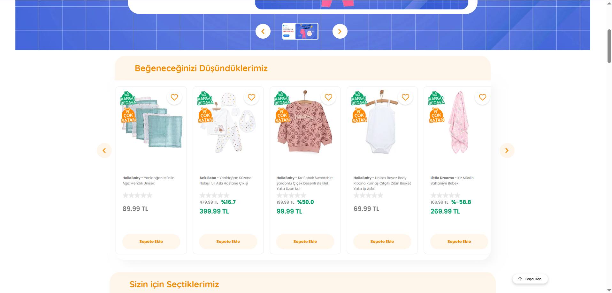
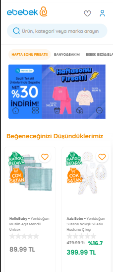

# Ebebek Add Carousel Project

Bu proje, Ebebek sayfasında ürünlerin listelenmesi, favori ürünlerin yönetilmesi ve yerel depolama kullanarak bu verilerin saklanması işlevselliğine sahip bir projedir. API'den veri çekilir ve kullanıcı, ürünleri favorilerine ekleyip çıkarabilir.

## Proje Görselleri
Tam Ekran Görünüm : 

Mobile Halinde Görünüm : 

## Özellikler

- Ürünleri API'den çekme
- Ürünleri listeleme
- Favori ürünleri ekleme ve çıkarma
- Favori ürünleri yerel depolama (localStorage) ile saklama
- Favori ikonu değiştirme (eklenen ürün için)
  
## Teknolojiler

- HTML, CSS, JavaScript
- API ile veri çekme
- Yerel depolama (localStorage)

## Kurulum

1. Projeyi bilgisayarınıza klonlayın:
   ```bash
   git clone <repo-url>
   
2. Ebebek ana sayfasında bu kodu console'a yapıştırın ve çalıştırın.
